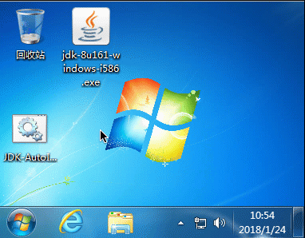
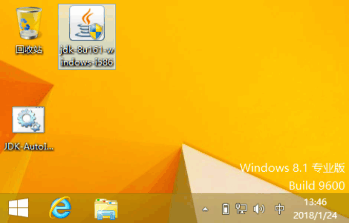
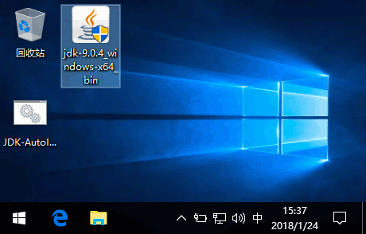

# JDK-AutoInstaller
Windows环境下一键下载安装最新JDK，自动配置环境变量

    
## V2视频演示：
* YouTube&nbsp;:&nbsp;[https://youtu.be/_A5kCdUJA44](https://youtu.be/_A5kCdUJA44)
* bilibili&nbsp;:&nbsp;[https://www.bilibili.com/video/av20686160/](https://www.bilibili.com/video/av20686160/)

## V2与V1版本的区别？
* V1只是自动安装，V2增加了自动下载

## 如何使用？
* V2:
    * 直接运行V2.0脚本，选择需要的安装项即可
* V1:
    * 下载JDK
    * 将JDK-AutoInstaller-v1.0.bat跟JDK安装包放在同一目录
    * 双击JDK-AutoInstaller-v1.0.bat脚本即可开始安装
    * 等待安装完成然后重启电脑即可

## 支持的操作系统？
* win7 / win8.x / win10 
* x86跟x64
* 以及对应的Server版本操作系统

## 支持的JDK版本？
* Oracle JDK 8-9

## Git mirror：

* GitHub&nbsp;:&nbsp;[https://github.com/KingFalse/JDK-AutoInstaller](https://github.com/KingFalse/JDK-AutoInstaller)    
* GitEE&nbsp;&nbsp;:&nbsp;[https://gitee.com/Kagura/JDK-AutoInstaller](https://gitee.com/Kagura/JDK-AutoInstaller)

## Q&A?
### Q1 : 默认安装目录?
* %ProgramFiles(x86)%\Java\jdk
* %ProgramFiles(x86)%\Java\jre
* 或者：
* %ProgramFiles%\Java\jdk
* %ProgramFiles%\Java\jre

### Q2 : 如何自定义JDK跟JRE的安装目录?(目前V2暂不支持自定义安装目录)
* 自定义安装目录有两种方式
* 方式一：(建议)
* 通过命令行参数：JDK-AutoInstaller-v1.0.bat "C:\jdk" "C:\jre"
* 方式二：
* 修改JDK-AutoInstaller-v1.0.bat第83-84行
~~~bat
83| set "absjdkpath="     修改后     set "absjdkpath=C:\jdk"
84| set "absjrepath="     修改后     set "absjrepath=C:\jre"
~~~

### Q3 : 环境变量?
* 安装完成会自动配置环境变量，您只需重启一下即可

## 特色？
* V2
    * 集成aria2c下载
    * 多种模式可选
    * 支持多版本安装
* V1
    * 支持自定义安装目录
    * 自动配置环境变量，采用修改注册表方式，完全防覆盖
    * 支持UAC权限申请
    * 绿色单文件

## V1示例
* win7x64 && JDK-8u161-i586

* win8.1x86 && JDK-8u161-i586

* win10x64 && JDK9.0.4

